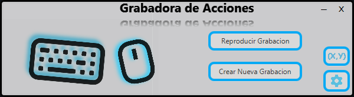
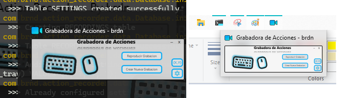
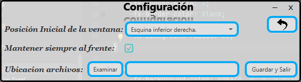
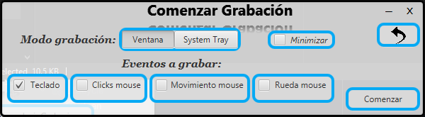

#  ActionRecorder 
ActionRecorder is a JavaFx application to record and replay user-computer interactions with multiple functionalities. 

## Development

This app was was developed using the following technologies:
1. JavaFx 19
2. Java SE 19.0.2
3. Scene Builder 8.5.0
4. Sqlite jdbc 3.36.0.3
5. Jnativehook 2.2.2 

This app has:
- Intuitive and colourful design. 
- Transparency effects.
- Data Persistence with SQLite Embedded database.
- Own minimize and close buttons.
- Window Drag Functionality.
- Object Oriented Design.
- Readable and documented Source code.

## Design 
### Main View


### Main View from the taskbar and tasks view


### Settings view


### Start recording  view


## Runing from source
To locally frun this project:
- Clone this repo and go to proyect root:
  ```
  git clone https://github.com/Brnd08/ActionRecorder
  cd ./ActionRecorder
  ```
- If you have a local maven instalation simply execute
  ```
  mvn javafx:run 
  ```
  Otherwhise user mvn wrapper file 
  ```
  ./mvnw javafx:run 
  ```
  You should be able see something like this
  
  
