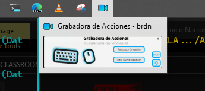

# ActionRecorder
ActionRecorder is a JavaFx application to record and replay user-computer interactions with multiple functionalities.

## Development

This app was was developed using the following technologies:
1. JavaFx 19
2. Java SE 19.0.2
3. Scene Builder 8.5.0
4. Sqlite jdbc 3.36.0.3
5. Jnativehook 2.2.2 

This app has:
- Intuitive and colourful design. 
- Transparency effects.
- Data Persistence with SQLite Embedded database.
- Own minimize and close buttons.
- Window Drag Functionality.
- Object Oriented Design.
- Readable and documented Source code.

## Design 
### Main View

### Main View from the taskbar

